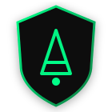
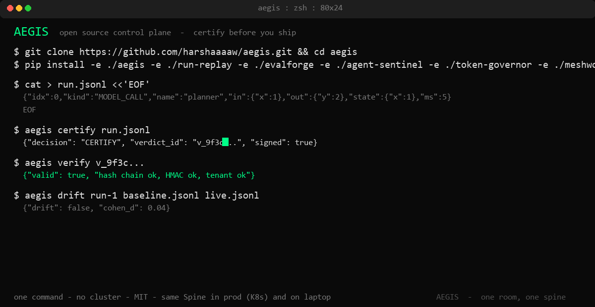
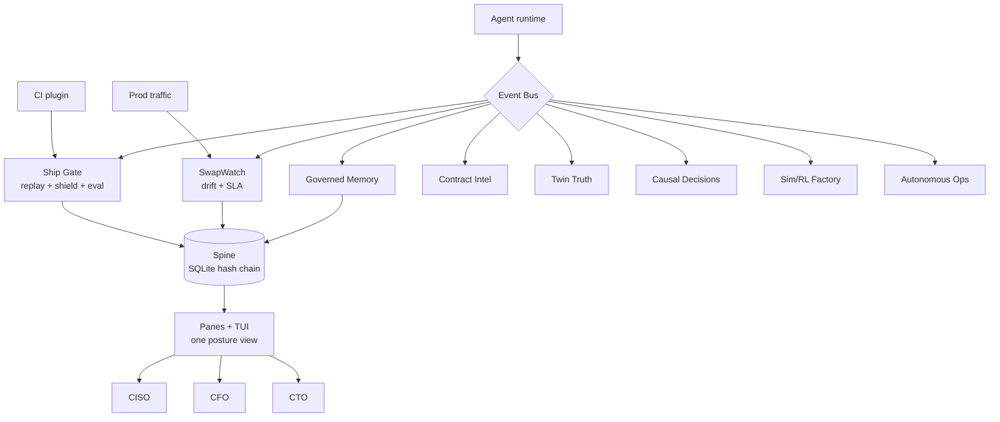

<p align="center">
  
</p>

<h1 align="center">Stop shipping AI agents you cannot prove are safe</h1>

<p align="center">
  <strong>Gartner 2026: 40% of autonomous agents will be demoted for governance failure by 2027.</strong><br/>
  AEGIS is the open source gate the other 60% ship through.
</p>

<p align="center"><strong>One open source room where every AI agent is certified before it ships, watched after it runs, and proven to auditors on one tamper-evident Spine.</strong></p>

<p align="center">

[](https://github.com/harshaaaaw/aegis)
[](LICENSE)
[](https://github.com/harshaaaaw/aegis/actions)
[](aegis/pyproject.toml)
[](https://github.com/harshaaaaw/aegis/releases)

</p>

<p align="center">

[Get started in 2 min](#quickstart) · [Documentation](aegis/README.md) · [Architecture](#architecture) · [Roadmap](ROADMAP.md) · [Security](SECURITY.md)

</p>

<p align="center">
   CERTIFY" width="860"/>
  <br/>
  <em>One command. No cluster. TUI dashboard included.</em>
</p>

AEGIS is the control plane we built because the usual setup does not work. Most teams have agents that touch refunds, PII, and deploys, logs in one place, evals in another, a spreadsheet for cost, and nothing that can prove to an auditor that version X was certified on date Y under model Z. When a provider swaps a model or a prompt gets exploited, you find out after the incident.

We put the whole lifecycle in one room. Every agent lives here, gets replayed and shielded before it merges, gets watched for drift after it ships, gets checked for memory access and tool scope, gets priced for ROI, and gets written to a single signed ledger. Same bus, same Spine, same identity. Ten subsystems that actually share state, not ten logos on a slide.

You run it on your laptop with one command. No cluster, no secret. Then open the dashboard and connect any agent - Claude, Codex, Hermes, OpenClaw, or your own CLI - to the same Spine.

```bash
git clone https://github.com/harshaaaaw/aegis.git && cd aegis
pip install -e ./aegis -e ./packages/run-replay -e ./packages/evalforge -e ./packages/agent-sentinel -e ./packages/token-governor -e ./packages/meshwork
aegis quickstart          # scaffold + certify demo run -> CERTIFY
aegis tui                 # dashboard: watch flow, manage anything
```

<p align="center">

| Who is this for? |  |  |
|---|---|---|
| 👩‍💻 **Builders** ship without worrying a prompt slips to prod | 💰 **Finance** sees real cost vs benefit, not spreadsheets | 🛡️ **Compliance** answers who certified what, in one query |

</p>

## The gap AEGIS fills

Gartner 2026: 40% of enterprises will demote or decommission autonomous agents by 2027 after governance gaps are found only after production incidents. Today that gap looks like this: agents that touch refunds, PII, and production deploys with no gate, providers that swap models behind a stable alias, CFOs who cannot prove ROI without spreadsheets, and SOC 2 PDFs that cannot answer an auditor asking who certified this action. Trusted AI teams and YC founders are now building the same fix - a control plane, not a checklist. AEGIS is that room, open source and self hostable: every agent lives in one place, gets tested before it ships, is watched after it runs, governed by policy, valued by finance, and proven to compliance on one audit trail.

> One room, one audit trail, one pane per executive. That is the moat no single feature can copy.

## Why teams choose AEGIS

|  |  |
|---|---|
| 🛡️ **Stop unsafe changes before the merge** | Replay, shield, and eval block risky changes automatically. |
| 👁️ **Catch silent drift after ship** | SwapWatch alerts when a model or tool changes under you. |
| 🧾 **Hand regulators receipts** | Every verdict is HMAC signed and hash chained with tenant scope. Audits become a query. |
| 🖥️ **Manage it in one terminal** | `aegis tui` shows flow, verdicts, posture, agents, skills - live. |

## Quickstart

No K8s, no JWT, no secret. 30 seconds to a signed verdict.

```bash
# 1. Clone and install
git clone https://github.com/harshaaaaw/aegis.git && cd aegis
python -m venv .venv && source .venv/Scripts/activate  # Windows: .venv\Scripts\activate
pip install -e ./aegis -e ./packages/run-replay -e ./packages/evalforge -e ./packages/agent-sentinel -e ./packages/token-governor -e ./packages/meshwork

# 2. One command proves the loop
aegis quickstart
# -> created run.jsonl
# -> {"decision": "CERTIFY", "verdict_id": "b6...", "verify": "aegis verify b6..."}

# 3. Open the dashboard (like Claude Code / Codex terminal)
aegis tui
# 1 Dashboard  2 Flow  3 Runs  4 Agents  5 Skills   c certify  a connect  q quit
```

Other paths (same gate):

```bash
aegis agent claude "summarize this repo"      # individual: claude, codex, hermes, openclaw
aegis agent generic --cmd "my-agent --flag" "task"  # any CLI
aegis skill list                               # grounded skills
aegis watch                                    # live tail without TUI
aegis certify run.jsonl && aegis verify <id>   # raw flow
```

[Full CLI reference →](aegis/README.md#quickstart)

## Connect any agent

Every agent writes to the same signed ledger. Use its own command or the generic one.

| Agent | Command |
|---|---|
| Claude Code | `aegis agent claude "task"` -> `claude --print "task"` |
| OpenAI Codex | `aegis agent codex "task"` -> `codex exec "task"` |
| Hermes | `aegis agent hermes "task"` -> `hermes agent "task"` |
| OpenClaw | `aegis agent openclaw "task"` -> `openclaw run "task"` |
| Any CLI | `aegis agent generic --cmd "my-agent --flag" "task"` |

Each run is recorded, replayed, shielded, evaled, signed, and streamed to `aegis tui` or `aegis watch`. If the CLI is not installed, a grounded mock still produces a verifiable CERTIFY/BLOCK so consumers can try without setup.

## Terminal dashboard

`aegis tui` is a Textual TUI (like `tuicode` and `agent-dashboard`) that hosts the control plane. No browser.

- **Dashboard** - recent verdicts, trust tier, drift count at a glance
- **Flow** - live Spine events (CERTIFY, BLOCK, drift, tier change) with notifications
- **Runs / Verdicts** - certify and verify without leaving the terminal
- **Agents** - connected agents and their last run, per-agent command shown
- **Skills** - installed skills, required ones starred, grounded check

Keys: `1` dashboard `2` flow `3` runs `4` agents `5` skills `c` certify demo `r` refresh `q` quit.

For headless or CI: `aegis watch` tails the same flow in plain logs.

## Features

|  | Capability | What it does |
|---|---|---|
| 🛡️ | Ship Gate | Forensic replay + per turn shield + golden set eval. Blocks bad merges. |
| 👁️ | SwapWatch | Drift vs certified baseline. Reconciles SLA cost. |
| 💰 | ROI Attest | Tamper evident cost and benefit ledger. |
| 🧠 | Governed Memory | Versioned memory with provenance and capability checks. |
| 📜 | Contract Intel | Tool scope guard. |
| 🪞 | Twin Truth | What if simulation without touching prod. |
| 📊 | Causal Decisions | OLS with honest intervals. |
| 🔁 | Sim/RL Factory | Prod failures -> golden cases for next gate. |
| 🤖 | Autonomous Ops | Shadow to live, instant demote on violation. |
| 🖥️ | Panes + TUI | One view posture + terminal dashboard. |
| 🔌 | Any-agent | Claude, Codex, Hermes, OpenClaw, generic CLI to one Spine. |
| 🧩 | Skills | Installable, grounded to flow, objective enforcing. |

Each writes to the same Spine and speaks only through the bus. Required skills (`aegis-certify`, `aegis-watch`, `aegis-drift`, `aegis-posture`) are always enabled and verified.

## Architecture



One K8s namespace in prod. One process on your laptop. Same contracts, no infra needed to try.

## Skills

Skills are the only way to extend the plane and they must prove they obey the objective.

```bash
aegis skill list                          # installed, required starred
aegis skill install aegis-roi             # from hub
aegis skill add ./my-skill                # local dir with SKILL.md
aegis skill verify aegis-watch            # grounded check
```

Required skills ship enabled: `aegis-certify`, `aegis-watch`, `aegis-drift`, `aegis-posture`. Install more from `aegis/src/aegis/skills/hub/` or `~/.aegis/skills/`. Each has `SKILL.md` with objective, triggers, inputs/outputs, and a verify hook. The TUI shows only grounded skills.

## How AEGIS compares

| Capability | Spreadsheet + logs | Vendor point tool | AEGIS |
|---|---|---|---|
| Pre merge gate | no | one dimension | replay + shield + eval |
| Tamper evident verdict + hash chain | no | rarely | yes |
| Drift watch after ship | no | partial | yes |
| ROI attest on one ledger | manual | no | yes |
| Ten subsystems on one spine | no | no | yes |
| Multi tenant, JWT + SSRF guard | varies | varies | first class |
| TUI dashboard | no | no | yes (flow + manage) |
| Any-agent connector | no | one | claude, codex, hermes, openclaw, generic |

The moat is the Spine: one signed record proves gate, run, attestation, and memory access under a role.

## Honest limitations

- Spec envisions Kafka + S3 + Neo4j. This build uses local bus and SQLite so you can run with zero infra. Backend is swappable, contract is real.
- Subsystems 2 to 9 are wired rooms with focused behavior (SwapWatch, ROI, Memory, Contract, Twin, Sim, Ops). Ship Gate and Causal carry real logic; others are ready for depth and are tested via posture and bus events.
- Eval pipeline concatenates outputs. Wire a real candidate pipeline before using it to ship.
- TUI is local-only (Textual). Multi-user hosted TUI is roadmap (see ROADMAP.md).

## Contributing

1. Fork the repo
2. Create a branch: `git checkout -b feature/your-feature`
3. Run the gate: `pytest -q && ruff check .`
4. Submit a PR with a clear description of your change and test evidence

We triage every PR and issue within 48 hours. See [CONTRIBUTING.md](CONTRIBUTING.md) for good first issues and the quality gate.

## Security

See [SECURITY.md](SECURITY.md) for reporting, trust boundaries, and cryptographic guarantees. Please do not open public issues for vulnerabilities.

## License

MIT © [Deva Harsha Mummareddy](https://github.com/harshaaaaw) - see [LICENSE](LICENSE)

---

<!-- Star history temporarily hidden due to GitHub API restriction - restore when star-history.com recovers -->
<p align="center"><em>Star history paused - GitHub restricted the stargazer API. Track stars on the repo page until it returns: <code>github.com/harshaaaaw/AEGIS</code></em></p>

<p align="center"><em>If AEGIS helped you ship safer agents, leave a star. It helps others find the project.</em></p>
