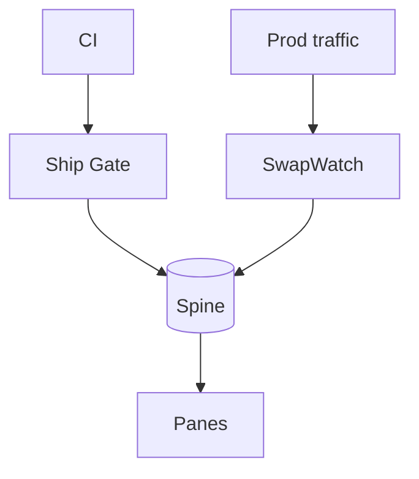

# Stop shipping AI agents you cannot prove are safe

> **Gartner 2026: 40% of autonomous agents will be demoted for governance failure by 2027.** AEGIS is the open source gate the other 60% ship through.

**One open source room where every AI agent is certified before it ships, watched after it runs, and proven to auditors on one tamper-evident Spine.**

[](https://github.com/harshaaaaw/aegis)
[](LICENSE)
[](https://github.com/harshaaaaw/aegis/actions)
[](aegis/pyproject.toml)

[Get started in 2 min](#quickstart) · [Documentation](aegis/README.md) · [Architecture](#architecture) · [Roadmap](ROADMAP.md) · [Security](SECURITY.md)

AEGIS is the control plane we built because the usual setup does not work. Agents touch refunds and PII, logs live in one place, evals in another, cost lives in a spreadsheet, and nothing proves to an auditor that version X was certified on date Y. When a model swaps or a prompt slips, you learn after the incident.

So we put everything in one room. One replay, shield, and eval before merge. One drift watch after ship. One ledger for memory, tools, and cost. Same bus, same Spine, same identity. Ten subsystems that actually share state, not ten logos on a slide. You can run it on your laptop with pip and one command. No cluster. MIT. Self-hosted.

```bash
git clone https://github.com/harshaaaaw/aegis.git && pip install -e ./aegis -e ./run-replay -e ./evalforge -e ./agent-sentinel -e ./token-governor -e ./meshwork && aegis certify run.jsonl
```

## The gap AEGIS fills

Agents touch money and PII with no gate. Providers swap models behind the same name. Cost lives in spreadsheets. Audits become projects. Gartner says 40% of teams will decommission agents over governance alone. AEGIS fixes it with a control plane, not a checklist - one place where every agent is tested, watched, valued, and proven.

> One room, one audit trail, one pane per executive. That is the moat no single feature can copy.

## Why teams choose AEGIS

- Stop unsafe agents before the merge. Replay, shield, and eval block risky changes automatically.
- Catch silent drift after ship. SwapWatch alerts when a model or tool changes under you.
- Hand regulators receipts. Every verdict is signed and hash chained, so audits are a query.

## Quickstart

No K8s, no JWT setup, no secret.

```bash
git clone https://github.com/harshaaaaw/aegis.git && cd aegis
python -m venv .venv && source .venv/Scripts/activate  # Windows: .venv\Scripts\activate
pip install -e ./aegis -e ./run-replay -e ./evalforge -e ./agent-sentinel -e ./token-governor -e ./meshwork

cat > run.jsonl <<'EOF'
{"idx":0,"kind":"MODEL_CALL","name":"planner","in":{"x":1},"out":{"y":2},"state":{"x":1},"ms":5}
EOF
aegis certify run.jsonl        # -> {"decision": "CERTIFY"}
aegis verify <verdict_id>      # -> {"valid": true}
```

Need Python or HTTP? See [aegis/README.md](aegis/README.md#quickstart) - same gate, `ShipGate` in Python and `POST /api/v1/gate/evaluate` over HTTP.

## Features

| What it does | How it helps |
|---|---|
| Ship Gate | Replay + shield + eval before merge. Blocks bad changes. |
| SwapWatch | Live drift check vs certified baseline. Keeps SLA honest. |
| ROI Attest | Signed cost and benefit ledger. No spreadsheet math. |
| Governed Memory | Versioned memory with provenance and access checks. |
| Contract Intel + Panes | Tool scope guard and one posture view for CISO, CFO, CTO. |

Full list of ten subsystems with details is in [Documentation](aegis/README.md). Each writes to the same Spine and talks only through the bus.

## Architecture



One process on your laptop, one namespace in prod. Same contracts.

<details>
<summary>How AEGIS compares</summary>

|  | Spreadsheet + logs | Point tool | AEGIS |
|---|---|---|---|
| Pre-merge gate | no | one check | replay + shield + eval |
| Hash chained receipts | no | rarely | yes |
| Drift after ship | no | partial | yes |
| One ledger for ROI | manual | no | yes |
| One spine for ten systems | no | no | yes |

The moat is the Spine. One signed record proves gate, run, attestation, and memory access under a role.

</details>

<details>
<summary>Honest limits</summary>

- Spec aims for Kafka + S3 + Neo4j. This build uses local bus and SQLite so you can run with zero infra. Backend is swappable, contract is real.
- Ship Gate carries real logic. Other subsystems are wired rooms ready for depth. Eval pipeline currently concatenates outputs - wire a real pipeline before using it to ship.

</details>

## Contributing

Fork, branch, `pytest -q && ruff check .`, open a PR with test evidence. We triage in 48 hours. See [CONTRIBUTING.md](CONTRIBUTING.md).

## Security

See [SECURITY.md](SECURITY.md). Do not open public issues for vulnerabilities.

## License

MIT © [Deva Harsha Mummareddy](https://github.com/harshaaaaw) - see [LICENSE](LICENSE)

---

[](https://star-history.com/#harshaaaaw/aegis&Date)

If AEGIS helped you ship safer agents, leave a star.
